<!--_paginate: true-->
<!-- _class: lead -->
### ngrok


---

<!--_paginate: true-->

## 前言

###### 當在開發網頁的時候，常常要線上測試畫面是否正常，或是提供線上畫面來DEMO檢驗。


###### 這時候就可能需要自己來架設一個服務，看是要讓其他人連線至開發的主機上，或者是部屬到網路空間上，如果還沒有要正式上線的話，就要提早負擔主機費用，甚至還需要花時間特別去設定，對於有期限的專案來說，太浪費時間了。

###### 於是我們可以使用 `ngrok` 這個第三方軟體，來快速的幫我們建立一個臨時的對外伺服器。

---
<!--_paginate: true-->
<!-- _class: lead -->

### 教學 

---
<!--_paginate: true-->
<!-- _class: lead -->
###### 先進入到 [ngrok官網](https://ngrok.com/)

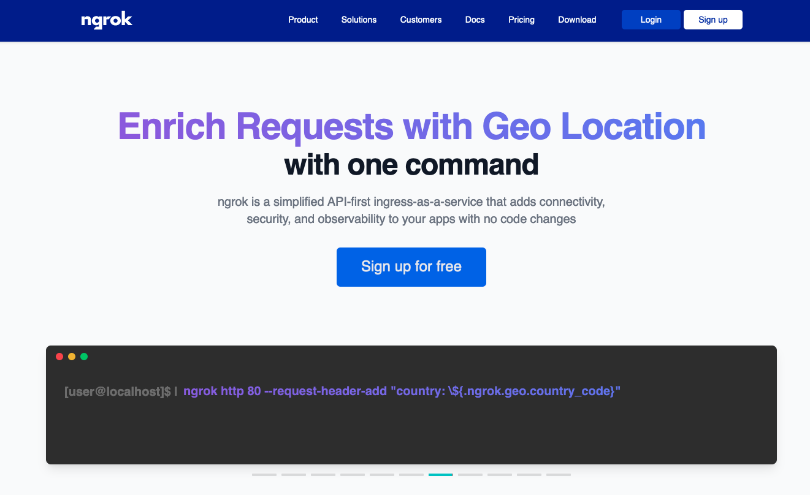

---

<!--_paginate: true-->
<!-- _class: lead -->

###### 點擊右上方的 登入/註冊

###### 有帳號可以直接登入，或是直接使用 google / github 來連接帳號啟用

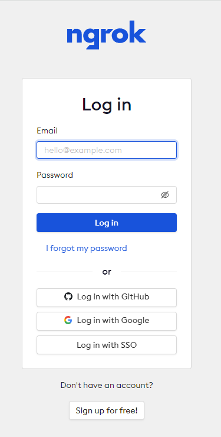


---

<!--_paginate: true-->
<!-- _class: lead -->

###### 登入後，會進到ngrok的後台

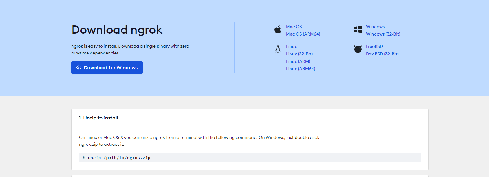

---

<!--_paginate: true-->
<!-- _class: lead -->

###### 依照作業環境，下載對應的檔案

###### 這邊以windows 作業環境為主

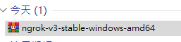

---

<!--_paginate: true-->
<!-- _class: lead -->

###### 將檔案解壓縮，並放到 `C:\Program Files\ngrok` 底下

###### 打開 `設定/系統/關於/進階系統設定`

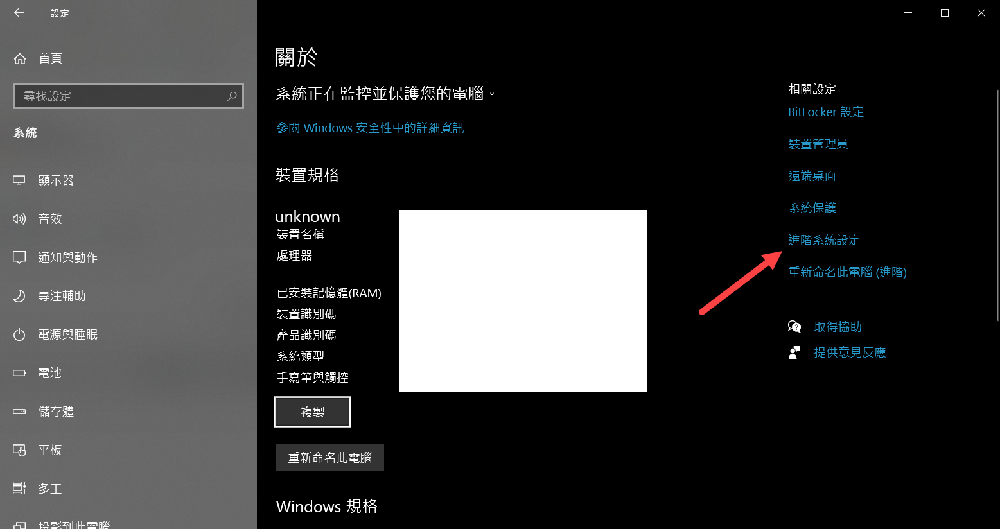

---

<!--_paginate: true-->
<!-- _class: lead -->

###### 點選 進階/ 環境變數

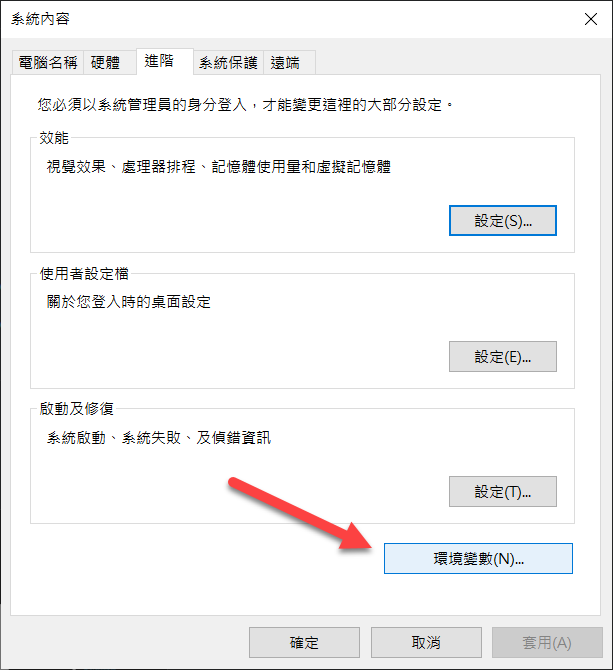

---
<!--_paginate: true-->
<!-- _class: lead -->

###### 選擇 Path  並點選編輯

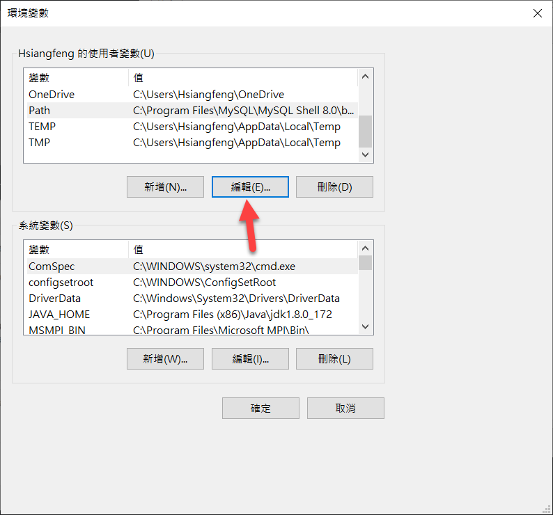

---

<!--_paginate: true-->
<!-- _class: lead -->

###### 點選右側新增，並加入 `C:\Program Files\ngrok`

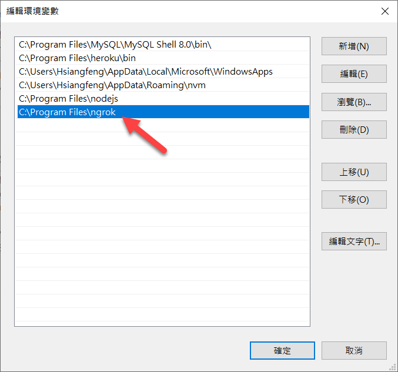

---

<!--_paginate: true-->
<!-- _class: lead -->

###### 打開終端機，並輸入 `ngrok`

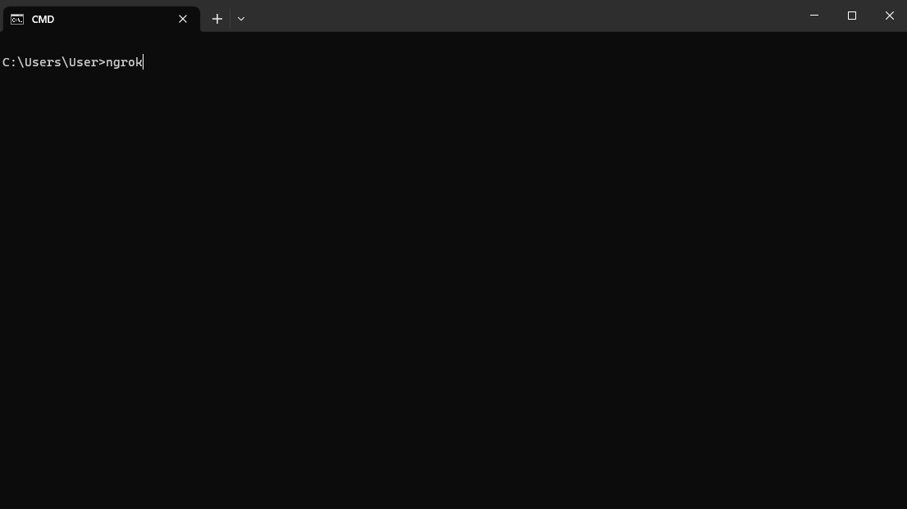

---

<!--_paginate: true-->
<!-- _class: lead -->

###### 有出現內容，表示已經安裝成功

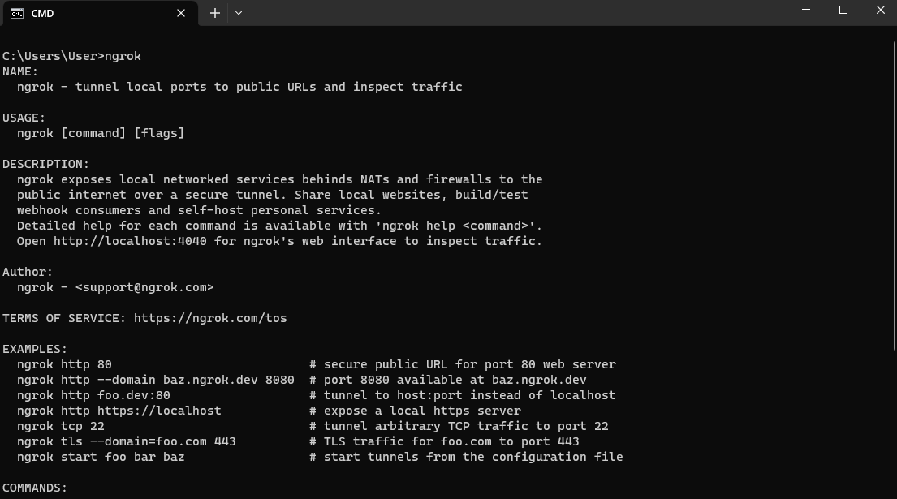

---

<!--_paginate: true-->
<!-- _class: lead -->

##### 回到 ngrok 後台頁面，並照著第二步操作 連接帳號

##### 複製下方指令 並輸入終端機 

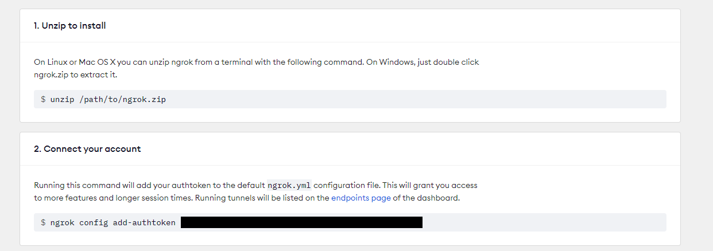

---

<!--_paginate: true-->
<!-- _class: lead -->

###### 有出現這段文字，表示已經連線成功了
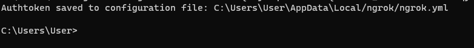

---

<!--_paginate: true-->
<!-- _class: lead -->

## 使用方式 

---

<!--_paginate: true-->
<!-- _class: lead -->

##### 1.在本地開啟服務，假設服務位置為 `http://localhost:5173`
##### 2.打開終端機 並輸入 `ngrok http 5173` 
##### 出現此畫面表示已經成功開啟 ngrok 並且已經正在運行
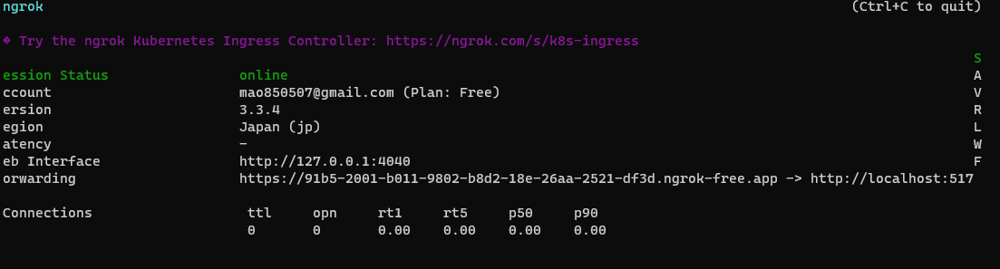

---

<!--_paginate: true-->
<!-- _class: lead -->

##### 接著將 `Forwarding` 這段的網址 貼到瀏覽器上

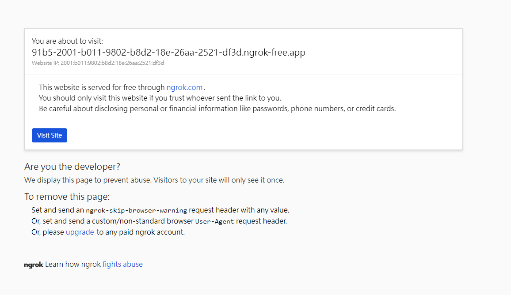

##### 按下 `Vite Site` 按鈕

##### 就可以進入到 本機環境的網頁了 ，對外就可以直接連線


---

<!--_paginate: true-->
<!-- _class: lead -->

##### 如果是vue專案環境
##### 需要給devServer加入設定


---
<!--_paginate: true-->
<!-- _class: lead -->


##### 使用 defineConfig : 
```javascript
const { defineConfig } = require('@vue/cli-service');
module.exports =defineConfig({
  devServer: {
    allowedHosts: 'all',
  },
})

```

---
<!--_paginate: true-->
<!-- _class: lead -->

##### 沒有使用 defineConfig : 
```javascript
module.exports = {
  devServer: {
     disableHostCheck: true,
   },
};

```

---

<!--_paginate: true-->
<!-- _class: lead -->

##### 每一次重新啟動 ngrok，都會產生一個新的 Forwarding，
##### 除非你有付費的 ngrok 帳號，否則你每次都要重新啟動 ngrok，才能取得新的 Forwarding 。
##### 如果要停止 ngrok ， 只要按下 `Ctrl + C`